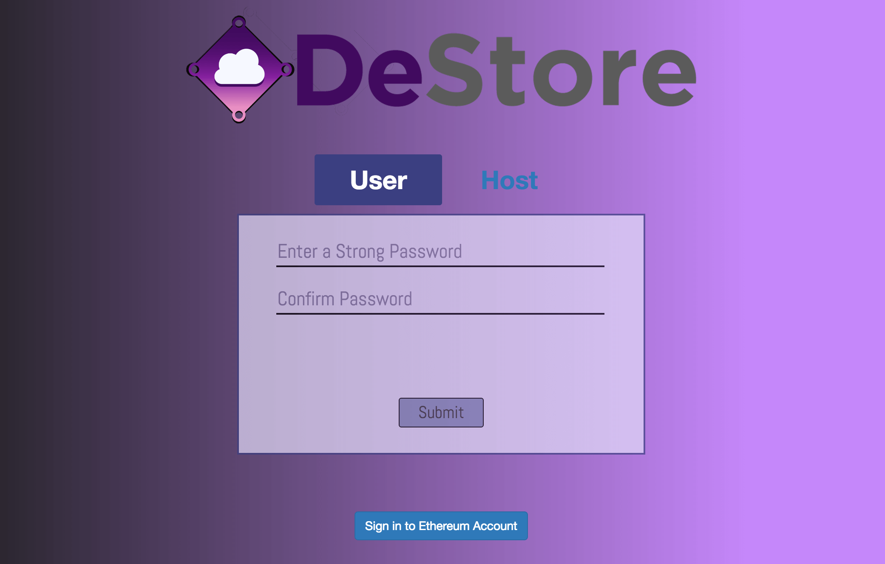
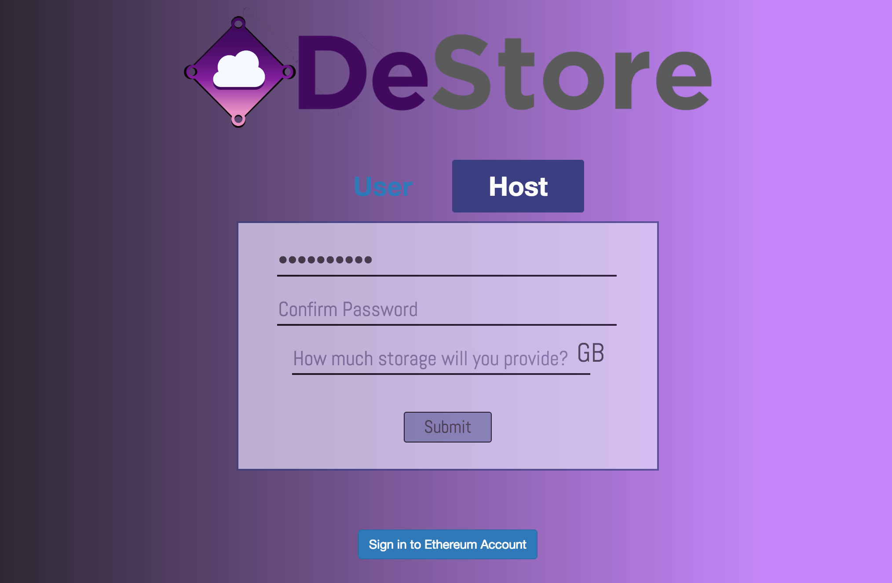
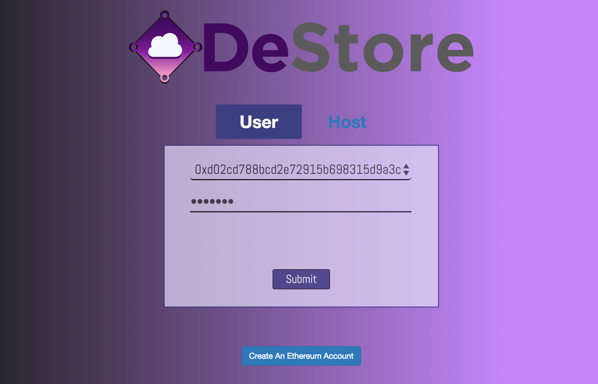
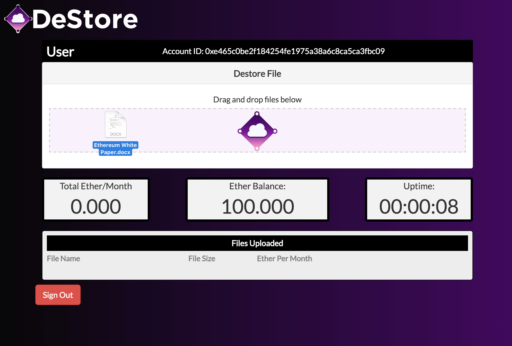
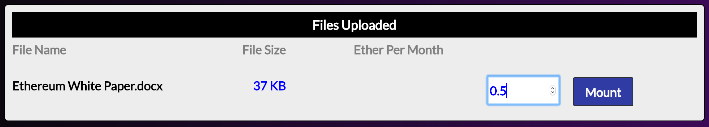
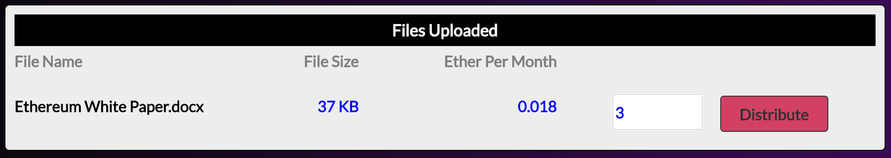
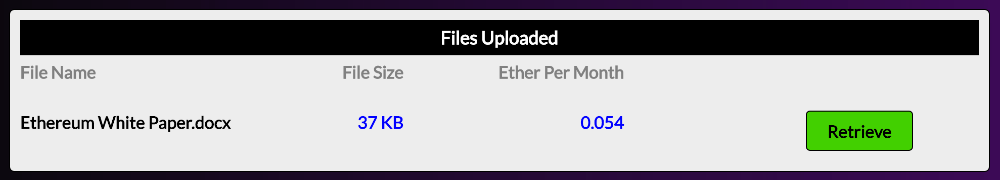
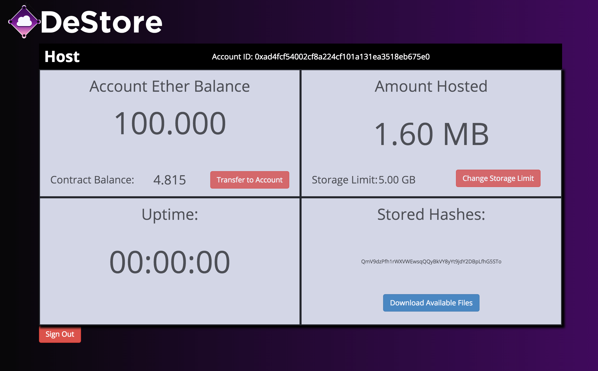

# Purpose
DeStore aims to create a decentralized peer-to-peer file storage platform with a trustless crytocurrency payment system. It is built on top of [Ethereum](https://www.ethereum.org/) to provide the platform with a decentralized logic base and dencentralized global state. It processes transactions using cryptocurrency called [Ether](https://www.ethereum.org/ether) It is also built using [IPFS](https://ipfs.io/) to provide the platform with content addressable peer-to-peer file distribution. 

### DeLib

While looking for a framework to build our app, we found that they were too restrictive for our purposes so we built: [DeLib](https://www.npmjs.com/package/DeLib), a light-weight, and fully-inclusive Ethereum library: 
- A Command Line Interface that allows creation of IPC and RPC connections
- Ethereum smart contract compile, build, and deployment functionality
- Promise-based architecture to abstract away the asynchronicity present while using Ethereum
- Testing environment (through simple [Tape](https://github.com/substack/tape) Promises)

# Setup

## Dependency Installation
In order to use the capabilities of DeStore, we must first [install IPFS](https://ipfs.io/docs/install) and [install geth](https://www.ethereum.org/cli#geth). Please follow the links to complete each respective download before starting the app.

## Package Installation

`npm install` to install all npm dependencies.

`npm start` to initialize the electron application.

# Application Overview

## Sign Up

A applicant on the Desktop application can choose between signing up as a:

- **User** (can pay to store to the distributed database made of real-world hosts)
- **Host** (saves other users' files to their hard drive for money in return)
	

       

### Loading Money into Ethereum Account

When the user creates a new DeStore account, a new Ethereum account is automatically created. To buy ether and transfer it into your DeStore account, use a third-party service such as [Coinbase](https://www.coinbase.com/places/united-states?locale=en), making a transaction to the specified Account Address. We recommend loading a minimum of 0.45 ether as a **User** and 0.1 as a **Host** before starting.

## User View

## Host View

# Future Features
	- Integrate geth child process into app securely
	- Further distribute files when encrypted files are deleted/tampered with